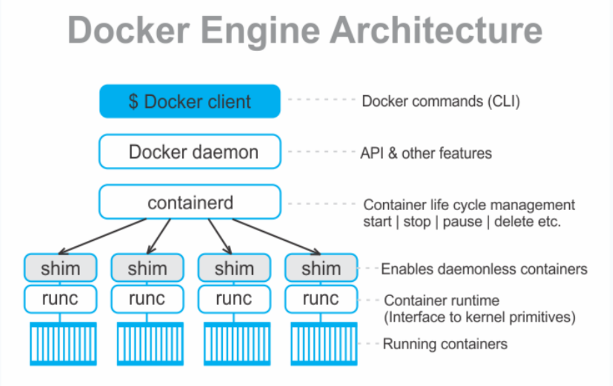

# Docker Architecture – Full Breakdown

Docker Architecture is a layered, modular system that enables the building, running, and management of containers using a **client-server model** and deep integration with Linux kernel features.

---

##  High-Level Components

###  Docker Client (`docker`)
- CLI tool that developers use to interact with Docker.
- Sends commands to Docker Daemon via REST API.

###  Docker Daemon (`dockerd`)
- Core Docker service.
- Listens to Docker API requests and manages Docker objects (containers, images, volumes, networks).
- Delegates lower-level operations to `containerd`.

### Docker Images & Containers
- **Images**: Templates for containers.
- **Containers**: Running instances of images.

###  Docker Registry
- Stores and shares Docker images.
- Example: Docker Hub.

###  Docker Objects
- Includes:
  - Volumes (persistent storage)
  - Networks (container communication)
  - Secrets, configs, etc.

---

##  Low-Level Internal Components

###  Docker Engine
- Core component of Docker including:
  - Docker Daemon
  - REST API
  - Docker CLI

###  containerd (`docker-containerd`)
- Manages container lifecycle:
  - Create, start, stop, delete
  - Image handling
  - Storage and networking
- Used directly by `dockerd`.

###  runc (`docker-runc`)
- A CLI tool for spawning and running containers.
- Implements **OCI runtime-spec**.
- Actually interacts with Linux kernel to isolate and run containers.

---

##  Summary Table

| Layer            | Component         | Description                                         |
|------------------|-------------------|-----------------------------------------------------|
| User Interface   | Docker CLI        | User-facing command line tool                       |
| API Layer        | Docker Daemon     | Manages Docker objects and handles API requests     |
| Runtime Manager  | containerd        | Manages container lifecycle                         |
| Runtime Executor | runc              | Creates containers using Linux kernel functionality |
| Image Store      | Docker Registry   | Stores and distributes Docker images                |

---

##  Visual Architecture

```text
┌────────────────────────────┐
│        Docker CLI          │
│        (docker)            │
└────────────┬───────────────┘
             │
┌────────────▼───────────────┐
│     Docker Daemon          │
│      (dockerd)             │
└────────────┬───────────────┘
             │
┌────────────▼───────────────┐
│       containerd           │
│  (docker-containerd)       │
└────────────┬───────────────┘
             │
┌────────────▼───────────────┐
│          runc              │
│    (docker-runc)           │
└────────────────────────────┘
```




