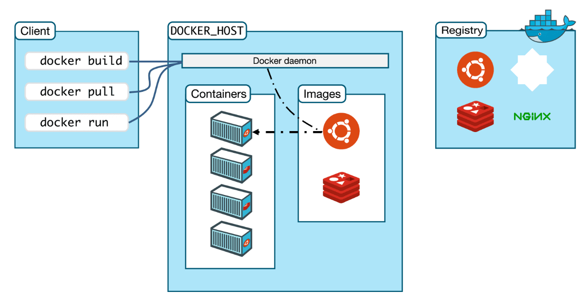

# Docker Architecture

Docker is an open-source platform that enables developers to build, deploy, and run applications inside **containers**. It simplifies application deployment by packaging everything (code, dependencies, libraries, configurations) into a standardized unit.  

Understanding **Docker architecture** is essential to know how containers are created, managed, and executed.

---

## 1. High-Level Overview

Docker follows a **client-server architecture**, consisting of three main components:

1. **Docker Client**  
   - The command-line tool (`docker`) that allows users to interact with Docker.  
   - Sends requests to the Docker Daemon using REST API over **UNIX socket** or **TCP**.  

2. **Docker Daemon (dockerd)**  
   - Runs on the host machine.  
   - Responsible for building, running, and managing containers, images, networks, and volumes.  
   - Listens to Docker API requests.  

3. **Docker Registry**  
   - A centralized service to store and distribute Docker images.  
   - The default registry is **Docker Hub**, but private registries can also be used.  



---

## 2. Detailed Components

### 2.1 Docker Client
- The user interacts with Docker primarily via CLI (`docker run`, `docker build`, etc.) or REST API.
- Commands issued are sent to the **Docker Daemon**.

---

### 2.2 Docker Daemon
- Core service that manages all Docker objects:
  - **Images** → Read-only templates to create containers.  
  - **Containers** → Running instances of images.  
  - **Networks** → Connect containers to each other.  
  - **Volumes** → Persistent data storage for containers.  

- The daemon can communicate with other daemons to manage containers across multiple hosts (Swarm/Kubernetes).

---

### 2.3 Docker Registry
- Stores **Docker Images**.  
- Workflow:  
  - `docker pull` → Downloads an image from the registry.  
  - `docker push` → Uploads an image to the registry.  
- Registries can be:  
  - **Public** (Docker Hub, Quay.io, etc.)  
  - **Private** (self-hosted registries).  

---

## 3. How Docker Works (Flow)

1. **User runs a Docker command** → e.g., `docker run nginx`.  
2. **Docker Client sends request** to Docker Daemon.  
3. **Docker Daemon checks** if the image exists locally:  
   - If **not available**, it pulls from Docker Registry.  
   - If **available**, it directly uses it.  
4. **Daemon creates a container** using the image.  
5. **Container runs** as an isolated process on the host machine.  

---

## 4. Architecture Diagram (Conceptual)

```
                +-----------------------+
                |     Docker Client     |
                |   (CLI / REST API)    |
                +-----------+-----------+
                            |
                            v
                +-----------------------+
                |     Docker Daemon     |
                |  (dockerd Service)    |
                +-----------+-----------+
                            |
        --------------------------------------------
        |                     |                     |
   +----------+          +----------+          +----------+
   |  Images  |          | Containers|         | Networks |
   +----------+          +----------+          +----------+
                            |
                            v
                +-----------------------+
                |   Docker Registry     |
                | (Docker Hub/Private)  |
                +-----------------------+
```

---

## 5. Key Objects in Docker

- **Images** → Blueprints for containers.  
- **Containers** → Running instances of images.  
- **Volumes** → Persistent storage.  
- **Networks** → Communication between containers.  

---

## 6. Benefits of Docker Architecture
- Lightweight (shares host OS kernel).  
- Portable across environments.  
- Faster deployments.  
- Easy scaling with orchestration tools.  
- Isolation of applications and dependencies.  


