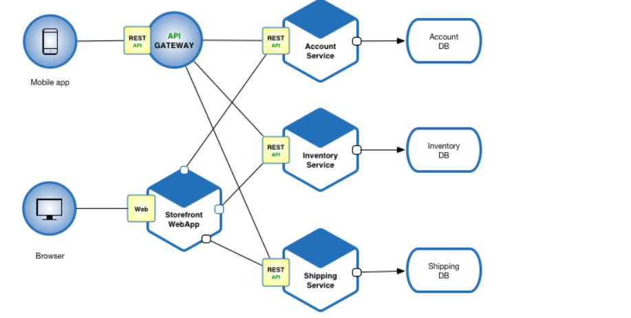

# What Are Microservices?

**Microservices** is an architectural style where an application is divided into multiple small, independent services, each responsible for a single piece of functionality.

Each service:

- Has its own database, logic, and codebase  
- Communicates with others via APIs (usually HTTP or messaging)  
- Can be deployed independently  

> Think of a team of specialists, each doing one job very well:

-  User Service  
-  Payment Service  
-  Notification Service  
-  Inventory Service  

---

## Microservices Architecture

##  Purpose of Microservices

Microservices were created to solve the problems of monoliths in large, complex systems.

**The goal:** Build applications that are modular, scalable, resilient, and allow independent development by multiple teams.

---

##  Why Microservices Are Useful

| Benefit                     | Explanation                                                         |
|-----------------------------|---------------------------------------------------------------------|
|  Separation of Concerns    | Each service is focused on a single responsibility.                  |
|  Independent Deployment    | Update one service without touching the others.                      |
|  Scalability               | Scale only the services that need it (e.g., checkout or search).     |
|  Team Autonomy            | Teams can own, develop, and deploy services separately.               |
|  Technology Flexibility    | Use different languages or databases for different services.         |
|  Better Security Isolation | Sensitive services (like payment) can be isolated.                   |

---

##  Challenges of Microservices

| Challenge                | Explanation                                                        |
|--------------------------|--------------------------------------------------------------------|
|  Operational Complexity | Requires orchestration, logging, monitoring tools.                  |
|  Network Overhead       | Communication between services happens over the network.            |
|  Data Consistency       | No shared database—must manage consistency across services.         |
|  Deployment Overhead    | Multiple CI/CD pipelines and versioning complexities.               |
|  Debugging              | Harder to trace bugs across distributed systems.                    |

---

##  Impact Today

###  Why Microservices Matter in Modern Software

Today’s applications are:

-  Cloud-native  
-  Global  
-  Used by millions  
-  Built by large, distributed teams  

**Microservices enable that scale and speed.**

---

##  Real-World Use Cases

- **Netflix**: Runs hundreds of microservices to stream video and personalize content  
- **Amazon**: Allows teams to innovate and deploy thousands of times a day  
- **Uber**: Uses microservices for maps, ride-matching, payments, etc.  

---

##  Microservices Work Well With Modern Tech

| Tech                    | How It Helps Microservices                                         |
|-------------------------|--------------------------------------------------------------------|
|  Docker                 | Packages each service with its dependencies                        |
|  Kubernetes             | Automates deployment, scaling, and healing of services             |
|  Prometheus + Grafana   | Observability tools for monitoring microservices                   |
|  Kafka / RabbitMQ       | Messaging systems to connect services asynchronously               |
|  API Gateway            | Central access point to all services with security and routing     |

---

## Comparison between Monolithic and Microservices

| Feature            | Monolith               | Microservices                    |
|--------------------|------------------------|----------------------------------|
| **Codebase**       | One unified project    | Many small projects              |
| **Deployment**     | One unit               | Independent per service          |
| **Scaling**        | Whole app              | Per service                      |
| **Teams**          | Centralized team       | Multiple autonomous teams        |
| **Tech Stack**     | One per app            | Multiple allowed                 |
| **Failure Impact** | Whole app              | Just the failed service          |
| **Complexity**     | Lower                  | Higher                           |

---
