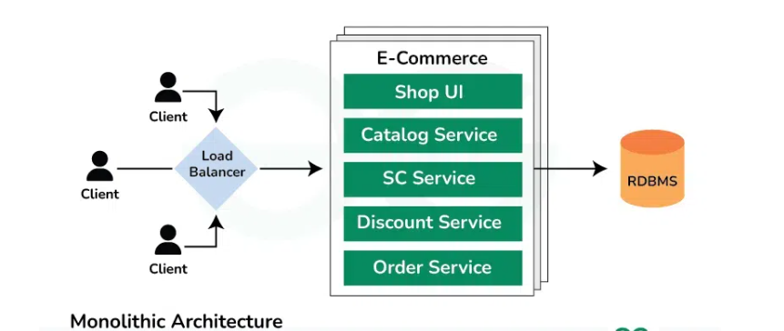

#  What is a Monolithic Application?

A **monolithic application** is built as a single, unified unit. All the functionality—user interface, business logic, data access layer—is tightly integrated and runs as one single process.

> Imagine a big box with everything inside:

-  Login system  
-  Order processing  
-  Payment gateway  
-  Admin panel  

All bundled together and deployed as one.

## Monolithic Architecture - System Design

---

##  Purpose of Monolithic Architecture

Monoliths were the standard for decades because:

-  Computers were centralized (e.g., mainframes, on-prem servers).  
-  Applications were simple or medium in scale.  
-  Deployment was manual or simple.  

It made sense to build everything together in one place.

---

##  Why Monoliths Were Useful

| Benefit              | Explanation                                              |
|----------------------|----------------------------------------------------------|
|  Simpler Development | Everything is in one project, one codebase.              |
|  Easier Testing       | Easy to test because all components are connected.      |
|  Quick to Deploy     | One file or package gets deployed.                       |
|  Minimal Overhead    | No need for inter-service communication or orchestration.|

---

##  Limitations of Monolithic Architecture

As applications grow, monoliths start to break down:

-  **Tight coupling**: Changing one part can affect others unexpectedly.
-  **Scaling issues**: You must scale the entire app even if only one part is overloaded.
-  **Slow development**: Teams block each other; everyone touches the same codebase.
-  **Difficult to adopt new tech**: You're stuck with the same language or framework for the whole app.
-  **Big-bang deployments**: Deploying one small feature may require deploying the whole app.

---
