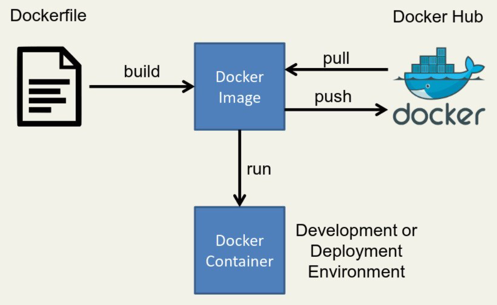

#  What is Docker?

Docker is a software framework for building, running, and managing containers on servers and the cloud. The term "Docker" may refer to either the tools (the commands and a daemon) or to the Dockerfile file format.

It used to be that when you wanted to run a web application, you bought a server, installed Linux, set up a LEMP stack, and ran the app. If your app got popular, you practiced good load balancing by setting up a second server to ensure the application wouldn't crash from too much traffic.

Times have changed, though, and instead of focusing on single servers, the Internet is built upon arrays of interdependent and redundant servers in a system commonly called "the cloud". Thanks to innovations like Linux kernel namespaces and cgroups, the concept of a server could be removed from the constraints of hardware and instead became, essentially, a piece of software. These software-based servers are called **containers**, and they're a hybrid mix of the Linux OS they're running on plus a hyper-localized runtime environment (the contents of the container).

---

##  What are Docker Containers?

Container technology can be thought of in three different categories:

- **Builder**: A tool or series of tools used to build a container, such as a Dockerfile for Docker.
- **Engine**: An application used to run a container. For Docker, this refers to the `docker` command and the `dockerd` daemon.
- **Orchestration**: Technology used to manage many containers, including Kubernetes and OKD.

Containers often deliver both an application and its configuration, meaning that you don't have to spend as much time getting an application in a container to run compared to when an application is installed from a traditional source. **Docker Hub** is a repository offering images for use by container engines.

The greatest appeal of containers is their ability to "die" gracefully and re-spawn when load balancing demands it. Whether a container's demise is caused by a crash or because it's simply no longer needed due to low server traffic, containers are **"cheap" to start**, and they're designed to seamlessly appear and disappear.

Because containers are meant to be **ephemeral** and to spawn new instances as often as required, it's expected that monitoring and managing them is **automated**, not handled by a human in real time.

---

##  Container Characteristics

Docker containers have:
- Their own **file system**
- Their own **dependency structure**
- Their own **processes**
- Their own **network capabilities**

This means the application has **everything it requires inside the container** and can run consistently **anywhere**.

Docker container technology uses the underlying **host operating system's kernel resources** directly, allowing containers to be lightweight and fast.

## What Are Docker Images?

A **Docker image** is a file used to execute code in a Docker container. It serves as a **template** containing a set of instructions to build and run a Docker container. You can think of it as a **snapshot**, similar to a virtual machine (VM) image.

Docker is used to **create**, **run**, and **deploy** applications in containers. A Docker image includes:

- Application code  
- Libraries  
- Tools  
- Dependencies  
- Configuration files  
- Other required files  

When a user runs an image, it becomes **one or more container instances**.

---

##  Docker Image Layers

Docker images consist of **multiple layers**, where:

- Each layer originates from the one below it, but introduces changes.
- Layers are **read-only**.
- Layers enable **faster builds**, **better reusability**, and **reduced disk usage**.
- When a container is created, a **writable layer** is added on top of the image.

---

##  What's Inside a Docker Image?

A Docker image includes everything needed to run a containerized application:

-  Application Code  
-  Configuration Files  
-  Environment Variables  
-  Libraries  
-  Runtime Environments  

When deployed to a Docker environment, the image is executed as a **Docker container**.

>  The `docker run` command creates a container from a specific image.

---

##  Docker Image Repositories

Docker images are **reusable assets** — they can be deployed on any host that supports Docker.

###  Benefits of Image Reuse:

- Save time by reusing static image layers across projects  
- Avoid recreating images from scratch  
- Share images easily between teams

###  Where Images Are Stored:

- **Public or private repositories**, such as [Docker Hub](https://hub.docker.com/)
- **Official images**: Maintained by Docker
- **Community images**: Created and shared by Docker users

Users can:

- Create **custom images** from existing ones  
- Use the `docker push` command to upload images to Docker Hub

---

##  Creating Docker Images

> **Note**: Docker images are typically created using a **Dockerfile**.

A `Dockerfile` is a script that contains a set of instructions to build an image. Developers define:

- The base image  
- Commands to install packages and dependencies  
- Configuration and environment settings  
- The startup command for the container

---

